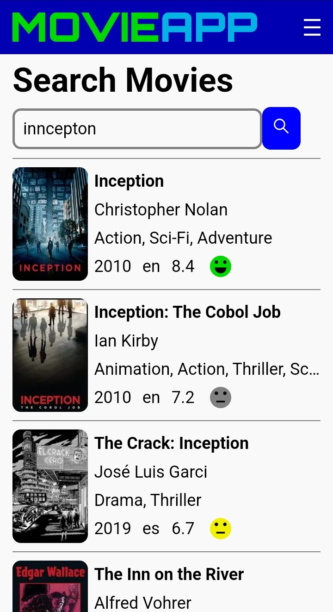
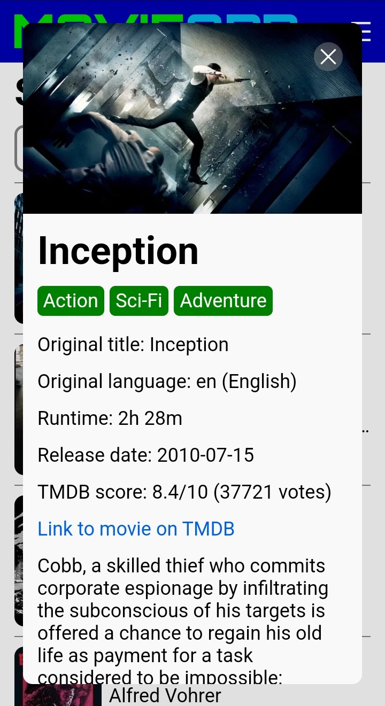
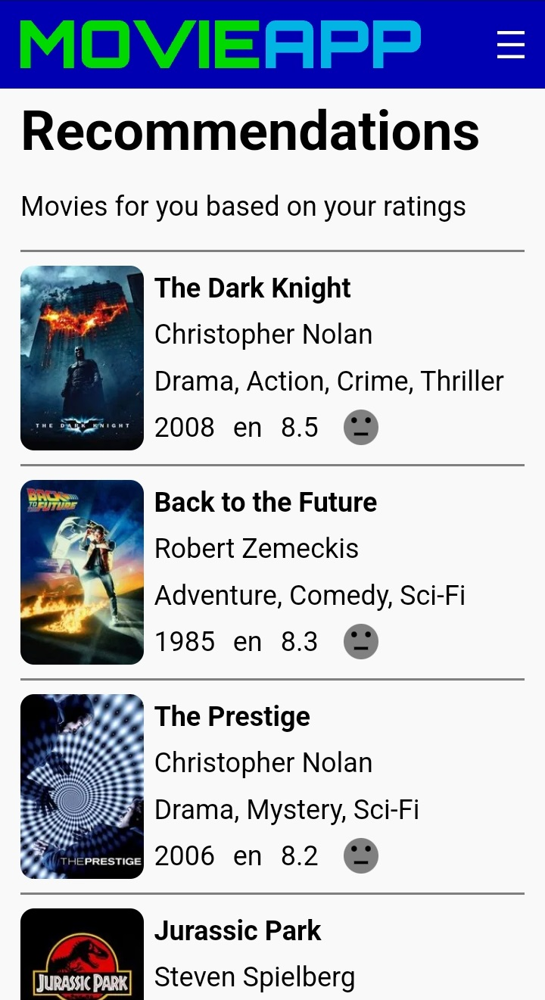

# MovieApp

MovieApp is my full-stack web application where users can search movies, rate movies and get personalized recommendations.

Link to deployed web app: https://movieapp.jcoder.dk

Link to repo for frontend project: https://github.com/pbollhorn/movie-app-frontend

Link to repo for backend project: https://github.com/pbollhorn/movie-app-backend

Author: Peter Bollhorn

## Features

- Search ~90,000 movies via trigram-based fuzzy search
- View movie posters
- View movie details, including full cast and crew, and if the movie belongs to a collection
- View list of movies for cast/crew member
- View list of movies in collection
- Rate movies 😀 (Good) or 😐 (OK/Bad)
- Get movie recommendations based on your ratings
- Mobile and desktop friendly
- Automatic light/dark mode according to browser setting

## Screenshots of deployed web app

<table>
<tr>
  <td></td>
  <td></td>
  <td></td>
</tr>
</table>

## Tech Stack

### Frontend
- React 19 – For building the user interface
- CSS Modules – For scoped and modular styling
- React Router DOM – For client-side routing

### Backend
- Java 17 - Programming language
- Maven - Build tool and dependency management
- Javalin - Lightweight web framework
- Hibernate - ORM for database access
- SLF4J/Logback - Logging
- Jackson - JSON serialization/deserialization
- Lombok - Reduces boilerplate code

### Database
- PostgreSQL 16 - Relational database
- pg_trgm - Extension used for trigram-based fuzzy search

### Deployment & Hosting
- GitHub Action (CI/CD pipeline)
- Docker / Docker Compose
- DigitalOcean - Cloud hosting provider
- Ubuntu 22 - OS running on the cloud server

### Tools
- VS Code – For frontend development
- IntelliJ IDEA – For backend development
- pgAdmin – For database management

## TMDB (The Movie Database)
This web app uses TMDB and the TMDB APIs but is not endorsed, certified, or otherwise approved by TMDB.

Link to TMDB: https://www.themoviedb.org/